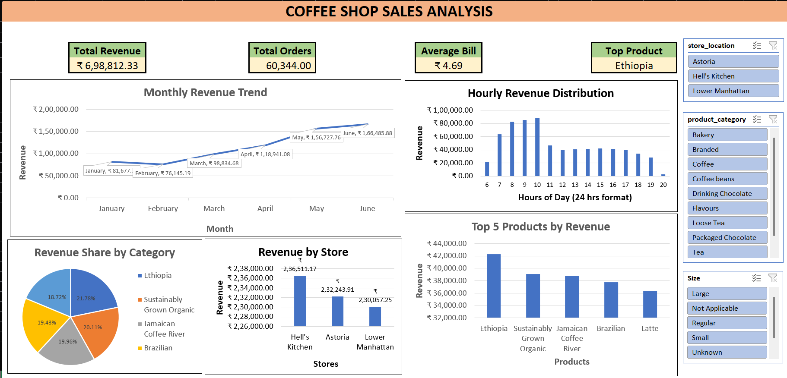

# ☕ Coffee Shop Sales Analysis Dashboard

An interactive **Microsoft Excel dashboard** developed to analyze coffee shop sales data and provide actionable business insights. This project focuses on cleaning raw transactional data, performing analytical calculations using Excel functions, and creating an interactive dashboard with Pivot Tables, Pivot Charts, and Slicers to support data-driven decision-making. 

---

## 📌 Project Overview

A coffee shop chain exported its Point of Sale (POS) transaction data into Excel. The dataset contained multiple data quality issues including duplicate records, missing store names, inconsistent product sizes, and combined timestamp values. These issues made it difficult for management to understand sales performance, customer behavior, and product trends.

The objective of this project was to clean and transform the data, calculate key business metrics, and develop an interactive dashboard that helps stakeholders analyze revenue, store performance, product sales, and customer purchasing patterns. 

---

## 🎯 Objectives

- Clean and standardize raw sales data
- Create derived analytical columns
- Perform KPI calculations using Excel formulas
- Analyze sales trends across time, products, and stores
- Build an interactive dashboard using Pivot Tables and Charts
- Generate business insights and recommendations

---

## 📊 Dashboard Preview

  

---

## 📈 Dashboard Features

### KPI Cards

- 💰 Total Revenue
- 🛒 Total Orders
- 💵 Average Bill Value
- ⭐ Top Selling Product

### Interactive Visualizations

- Monthly Revenue Trend
- Hourly Revenue Distribution
- Revenue Share by Product Category
- Revenue by Store Location
- Top 5 Products by Revenue

### Interactive Filters (Slicers)

- Store Location
- Product Category
- Product Size

---

# 🧹 Data Cleaning

The <a href="https://github.com/ruhi1326/Coffee_Sales_Dashboard/blob/main/Coffee_Sales_Dataset.xlsx">raw dataset</a> required several preprocessing steps before analysis.

### Cleaning Tasks Performed

- Removed duplicate records
- Filled missing store locations
- Standardized Size column
  - Corrected spelling mistakes
  - Fixed inconsistent text formatting
  - Filled blank values
- Split Timestamp into separate Date and Time columns
- Removed unnecessary columns
- Checked for invalid Quantity and Price values
- Applied formatting for better readability 

---

# 🔧 Data Transformation

Created additional columns to support analysis.

- Total Bill
- Month Number
- Month Name
- Day Name
- Day Type (Weekday / Weekend)
- Hour of Day 

---

# 🧮 Excel Functions Used

This project uses Excel formulas instead of Power Query or VBA for analytical calculations.

- SUMIFS()
- COUNTIFS()
- AVERAGEIFS()
- MAXIFS()
- MINIFS()
- IF()
- TEXT()
- MONTH()
- WEEKDAY()
- HOUR()
- UNIQUE()
- SORT()

---

# 📊 Pivot Tables & Analysis

Pivot Tables were used to answer important business questions including:

### Time Analysis

- Monthly Revenue Trend
- Revenue by Hour
- Revenue by Day of Week

### Store Analysis

- Revenue by Store
- Store Ranking
- Average Bill by Store

### Product Analysis

- Top 5 Products by Revenue
- Revenue Share by Category
- Product Size Analysis

### Business Insights

- Peak Sales Hours
- Weekend Product Performance
- Store-wise Large Size Drink Sales

---

# 📌 Key Performance Indicators (KPIs)

| KPI | Value |
|------|--------:|
| Total Revenue | ₹6,98,812.33 |
| Total Orders | 60,344 |
| Total Units Sold | 2,14,470 |
| Average Bill | ₹4.69 |
| Top Product | Ethiopia | 

---

# 💡 Key Insights

- Manhattan generated the highest overall revenue.
- Large-size beverages contributed significantly to total revenue.
- Orders with quantity greater than three were relatively low, indicating opportunities for combo offers.
- Revenue distribution across stores remained balanced.
- Coffee products contributed the largest share of overall sales. 

---

# ✅ Business Recommendations

- Increase staffing during peak morning hours.
- Promote coffee-focused combo offers and loyalty programs.
- Encourage customers to upgrade to Large-sized beverages.
- Replicate successful promotional strategies during slower months.
- Introduce bundle offers to increase average basket size. 
---

# 🛠️ Tools & Technologies

- Microsoft Excel
- Pivot Tables
- Pivot Charts
- Slicers
- Excel Functions
- Conditional Formatting
- Data Cleaning
- Dashboard Design

---

# 🎓 Skills Demonstrated

- Data Cleaning
- Data Transformation
- Data Analysis
- Dashboard Development
- Business Intelligence
- Excel Automation using Functions
- Data Visualization
- KPI Reporting
- Business Insight Generation

---

## 👨‍💻 Author

**Hinal Patel**

Aspiring Data Analyst passionate about transforming raw data into meaningful business insights through Excel, SQL, Power BI, and Python.

- 💼 LinkedIn: https://linkedin.com/in/patelhinal-

---

## ⭐ If you found this project useful, consider giving it a star!
